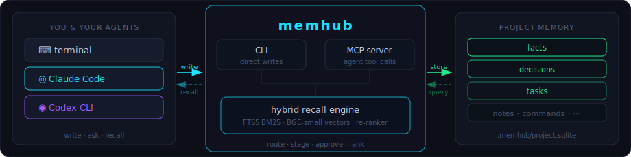
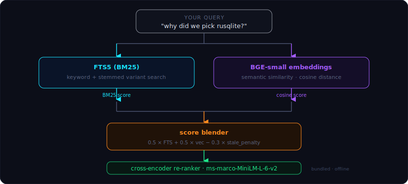

# memhub

*Your AI agents forget things. memhub doesn't.*

<p align="center">
  
  
  
  <br/>
  
  
  
  <br/>
  
</p>

---

If you've ever started a coding session by re-explaining your build setup, your naming conventions, or why that one architectural decision was made — that's the problem memhub solves.

memhub is a small, offline memory system for AI coding assistants — per-repo by default, with an optional machine-wide layer for cross-repo truths. It gives Claude Code, Codex CLI, and OpenCode CLI one shared, searchable store of project knowledge — decisions, facts, tasks, notes, and your own reference docs — built on SQLite with semantic search bundled into the binary.

No cloud. No account. No daemon. No model download at runtime. Just a `.sqlite` file next to your code and a binary on your PATH.

<br>

<p align="center">
  
</p>

---

## What you actually get

- **Context that sticks.** "What's the build command?" gets a real answer on day 90, not just day 1. The agent looks it up; you stop repeating yourself.
- **Decisions with reasons.** Six months from now you'll know *why* a call was made, not just that it was made. "We switched to rusqlite bundled mode because X" stays findable forever.
- **Your docs are searchable too.** Point memhub at an API spec, design system, or compliance doc and the agent pulls the relevant section on demand — no pasting the whole file into the prompt. A styling question surfaces the right color token table; a backend question stays completely silent on the style guide.
- **You stay in control.** Agent proposals stage for review before anything becomes durable. You see exactly what the agent wants to commit, and you can say no.
- **Same memory across agents.** Claude Code, Codex, and OpenCode share the same rows. Switching tools doesn't cost you context.
- **Memory that follows you between machines.** Opt in per repo and your laptop and desktop stay in sync through a folder that's already syncing (Google Drive for Desktop, or an rclone mount) — memhub still never goes online. `/catch-up` when you sit down, `/wrap-up` when you're done.
- **Optional machine-wide memory.** Truths that aren't about one repo — toolchain facts, a standing engineering rule, a universal style guide — can live in an opt-in store shared by every repo on the machine. Off by default; you promote to it deliberately.
- **Small context, relevant content.** A targeted recall bundle is much smaller than pasting your full project README into every prompt. The Token Metrics dashboard estimates how much context you're saving.
- **It's just a file.** SQLite, gitignored, in your repo. No accounts, no services, no vendor lock-in. Back it up, move it, or `rm -rf .memhub/` and it's gone.

---

## A session in practice

In a normal session, you talk to your agent and memhub runs in the background. At the end you run `/wrap-up` — a slash command in Claude Code — and the agent walks you through everything it wants to commit, one item at a time. You say yes or no to each one.

```
You: "What did we decide about the authentication flow?"
  → memhub.recall "authentication flow"  (returns cited evidence bundle)

You: "Add a task to refactor the cache layer."
  → task_add "refactor cache layer"  (direct write)

You: "We're going to use rusqlite bundled mode because it avoids setup friction."
  → propose_decision ...  (staged for your review)

You: "/wrap-up"
  → agent walks through staged proposals one by one
  → you approve or skip each one
  → session note written, PROJECT.md re-rendered
```

The `/wrap-up` gate is the whole point. The agent is good at surfacing and structuring knowledge; you decide what's true.

You can also drive it directly from the terminal — both flows write to the same database:

```bash
memhub recall "auth flow"
memhub task add "Refactor cache layer"
memhub fact add build-command "cargo build --release"
memhub decision add "use rusqlite bundled mode" \
  --rationale "Avoid system SQLite setup friction."
memhub render
```

---

## Quickstart

### Install via Claude Code (recommended)

Open Claude Code in the repo you want memhub to track and paste:

```
Please install memhub for me, then turn on hybrid recall.

1. Clone https://github.com/kninetimmy/memhub.git into ~/src/memhub if it
   isn't already there (`git pull` if it is). Stop if the Rust toolchain
   (1.85+) is missing.
2. Run `cargo install --path ~/src/memhub --force` so `memhub` ends up on
   PATH (~/.cargo/bin must be on PATH; warn me if it isn't). First build
   takes a couple of minutes — it downloads and bundles a ~130 MB
   embedding model into the binary.
3. Run `memhub --version` to verify.
4. Copy the user-level skills so /wrap-up, /catch-up, /check-init,
   /init-project, /recall, /reindex, /eval-recall, /doc, /metrics, /viz,
   /global, and /upgrade all work as slash commands:

       cp ~/src/memhub/templates/skills/claude/*.md ~/.claude/commands/

5. cd back to this repo and run `memhub init`, then `memhub status`.
   Tell me what status reports.
6. Ask me: hybrid recall (recommended — semantic + keyword) or FTS-only
   (lighter, keyword search only)?
     - If I say hybrid: append `[retrieval]\nmode = "hybrid"` to
       .memhub/config.toml, then run `memhub index rebuild --actor
       claude-code:reindex`. Report how many rows were embedded.
     - If I say FTS: nothing to do; the default is already FTS.
7. Run `memhub recall "<some keyword from my project>" --max-results 3`
   so I can see the recall surface working end-to-end.
8. Tell me about the optional machine-global store: a second SQLite at
   ~/.memhub/global.sqlite, shared by every repo on this machine, for
   machine/toolchain facts and standing engineering policy — it's the
   global-vs-repo CLAUDE.md idea, made retrievable. Off by default and
   per-repo opt-in. Ask whether to enable it for this repo:
     - If I say yes: run `memhub global enable` and report the store
       path. Note that writing to global is always a deliberate human
       action — never promote to global on your own; repo is the safe
       default.
     - If I say no: just note `/global` and `memhub global enable` are
       available anytime.
9. Tell me memhub can also ingest long reference docs (design specs,
   API contracts) as RAG-searchable material. After the first doc add,
   relevant doc chunks automatically surface in plain recall — gated by
   a relevance threshold so off-topic docs stay silent. Ask whether I
   want to ingest one now — if I give you a path, run
   `memhub doc add "<path>" --json` and report the chunk count;
   if not, just note `/doc` is available anytime.
10. Tell me memhub can sync this repo's memory between my own machines
    through a folder that already syncs (Google Drive for Desktop, or an
    rclone mount on Linux) — memhub stays offline and only reads/writes a
    local path. It's off by default and opt-in per repo. Ask whether I
    work across machines:
      - If I say yes: run `memhub sync enable`, then ask me for the
        absolute path of the synced folder on this machine and set it as
        `[sync] drive_subpath` in .memhub/config.toml. Run
        `memhub sync status` and report the resolved remote dir. Note
        that `/catch-up` pulls at session start and `/wrap-up` pushes at
        the end.
      - If I say no: just note `/catch-up`, `/wrap-up`, and
        `memhub sync enable` are available anytime.

Don't touch any files in this repo other than what `memhub init` writes
(.memhub/ and the generated-output .gitignore entries), the
.memhub/config.toml edits in steps 6, 8, and 10, and — only if I opt in
at step 8 — the machine-global store at ~/.memhub/global.sqlite (outside
this repo, in my home directory; that is expected).
```

### Install via Codex CLI

Open Codex in the repo you want to track and paste:

```
Please install memhub for me, then turn on hybrid recall.

1. Clone https://github.com/kninetimmy/memhub.git into ~/src/memhub if it
   isn't already there (`git pull` if it is). Stop if the Rust toolchain
   (1.85+) is missing.
2. Run `cargo install --path ~/src/memhub --force` so `memhub` ends up on
   PATH (~/.cargo/bin must be on PATH; warn me if it isn't). First build
   takes a couple of minutes — it downloads and bundles a ~130 MB
   embedding model into the binary.
3. Run `memhub --version` to verify.
4. Register memhub as an MCP server so you can call it as a structured
   tool. Append this to ~/.codex/config.toml:

       [mcp_servers.memhub]
       command = "memhub"
       args = ["serve"]

5. Copy the user-level skills so /wrap-up, /catch-up, /check-init,
   /init-project, /recall, /reindex, /eval-recall, /doc, /metrics, /viz,
   /global, and /upgrade all work:

       cp -R ~/src/memhub/templates/skills/codex/* ~/.codex/skills/

6. cd back to this repo and run `memhub init`, then `memhub status`.
   Tell me what status reports.
7. Ask me: hybrid recall (recommended — semantic + keyword) or FTS-only
   (lighter, keyword search only)?
     - If I say hybrid: append `[retrieval]\nmode = "hybrid"` to
       .memhub/config.toml, then run `memhub index rebuild --actor
       codex:reindex`. Report how many rows were embedded.
     - If I say FTS: nothing to do; the default is already FTS.
8. Run `memhub recall "<some keyword from my project>" --max-results 3`
   so I can see the recall surface working end-to-end.
9. Tell me about the optional machine-global store: a second SQLite at
   ~/.memhub/global.sqlite, shared by every repo on this machine, for
   machine/toolchain facts and standing engineering policy — it's the
   global-vs-repo AGENTS.md idea, made retrievable. Off by default and
   per-repo opt-in. Ask whether to enable it for this repo:
     - If I say yes: run `memhub global enable` and report the store
       path. Note that writing to global is always a deliberate human
       action — never promote to global on your own; repo is the safe
       default.
     - If I say no: just note `/global` and `memhub global enable` are
       available anytime.
10. Tell me memhub can also ingest long reference docs (design specs,
    API contracts) as RAG-searchable material. After the first doc add,
    relevant doc chunks automatically surface in plain recall — gated by
    a relevance threshold so off-topic docs stay silent. Ask whether I
    want to ingest one now — if I give you a path, run
    `memhub doc add "<path>" --json` and report the chunk count;
    if not, just note `/doc` is available anytime.
11. Tell me memhub can sync this repo's memory between my own machines
    through a folder that already syncs (Google Drive for Desktop, or an
    rclone mount on Linux) — memhub stays offline and only reads/writes a
    local path. The `memhub.sync_*` MCP tools are the agent-first
    surface; they default to the canonical synced folder. It's off by
    default and opt-in per repo. Ask whether I work across machines:
      - If I say yes: run `memhub sync enable`, then ask me for the
        absolute path of the synced folder on this machine and set it as
        `[sync] drive_subpath` in .memhub/config.toml. Run
        `memhub.sync_status` and report the resolved remote dir. Note
        that `/catch-up` pulls at session start and `/wrap-up` pushes at
        the end.
      - If I say no: just note `/catch-up`, `/wrap-up`, and
        `memhub sync enable` are available anytime.

Don't touch any files in this repo other than what `memhub init` writes
(.memhub/ and the generated-output .gitignore entries), the
.memhub/config.toml edits in steps 7, 9, and 11, and — only if I opt in
at step 9 — the machine-global store at ~/.memhub/global.sqlite (outside
this repo, in my home directory; that is expected).
```

### Install via OpenCode CLI

Open OpenCode in the repo you want to track and paste:

```
Please install memhub for me, then turn on hybrid recall.

1. Clone https://github.com/kninetimmy/memhub.git into ~/src/memhub if it
   isn't already there (`git pull` if it is). Stop if the Rust toolchain
   (1.85+) is missing.
2. Run `cargo install --path ~/src/memhub --force` so `memhub` ends up on
   PATH (~/.cargo/bin must be on PATH; warn me if it isn't). First build
   takes a couple of minutes — it downloads and bundles a ~130 MB
   embedding model into the binary.
3. Run `memhub --version` to verify.
4. Register memhub as an MCP server so you can call it as a structured
   tool. Add this to ~/.config/opencode/opencode.json:

       {
         "$schema": "https://opencode.ai/config.json",
         "mcp": {
           "memhub": {
             "type": "local",
             "command": ["memhub", "serve"],
             "enabled": true
           }
         }
       }

   If that file already exists, merge only the `mcp.memhub` block.
5. Copy the user-level skills so /wrap-up, /catch-up, /check-init,
   /init-project, /recall, /reindex, /eval-recall, /doc, /metrics, /viz,
   /global, and /upgrade all work:

       mkdir -p ~/.config/opencode/skills ~/.config/opencode/commands
       cp -R ~/src/memhub/templates/skills/opencode/* ~/.config/opencode/skills/
       cp ~/src/memhub/templates/commands/opencode/*.md ~/.config/opencode/commands/

6. Restart OpenCode so it reloads config, skills, and commands.
7. cd back to this repo and run `memhub init`, then `memhub status`.
   Tell me what status reports.
8. Ask me: hybrid recall (recommended — semantic + keyword) or FTS-only
   (lighter, keyword search only)?
     - If I say hybrid: append `[retrieval]\nmode = "hybrid"` to
       .memhub/config.toml, then run `memhub index rebuild --actor
       opencode:reindex`. Report how many rows were embedded.
     - If I say FTS: nothing to do; the default is already FTS.
9. Run `memhub recall "<some keyword from my project>" --max-results 3`
   so I can see the recall surface working end-to-end.
10. Tell me about the optional machine-global store: a second SQLite at
    ~/.memhub/global.sqlite, shared by every repo on this machine, for
    machine/toolchain facts and standing engineering policy — it's the
    global-vs-repo AGENTS.md idea, made retrievable. Off by default and
    per-repo opt-in. Ask whether to enable it for this repo:
      - If I say yes: run `memhub global enable` and report the store
        path. Note that writing to global is always a deliberate human
        action — never promote to global on your own; repo is the safe
        default.
      - If I say no: just note `/global` and `memhub global enable` are
        available anytime.
11. Tell me memhub can also ingest long reference docs (design specs,
    API contracts) as RAG-searchable material. After the first doc add,
    relevant doc chunks automatically surface in plain recall — gated by
    a relevance threshold so off-topic docs stay silent. Ask whether I
    want to ingest one now — if I give you a path, run
    `memhub doc add "<path>" --json` and report the chunk count;
    if not, just note `/doc` is available anytime.
12. Tell me memhub can sync this repo's memory between my own machines
    through a folder that already syncs (Google Drive for Desktop, or an
    rclone mount on Linux) — memhub stays offline and only reads/writes a
    local path. The `memhub.sync_*` MCP tools are the agent-first
    surface; they default to the canonical synced folder. It's off by
    default and opt-in per repo. Ask whether I work across machines:
      - If I say yes: run `memhub sync enable`, then ask me for the
        absolute path of the synced folder on this machine and set it as
        `[sync] drive_subpath` in .memhub/config.toml. Run
        `memhub.sync_status` and report the resolved remote dir. Note
        that `/catch-up` pulls at session start and `/wrap-up` pushes at
        the end.
      - If I say no: just note `/catch-up`, `/wrap-up`, and
        `memhub sync enable` are available anytime.

Don't touch any files in this repo other than what `memhub init` writes
(.memhub/ and the generated-output .gitignore entries), the
.memhub/config.toml edits in steps 8, 10, and 12, and — only if I opt in
at step 10 — the machine-global store at ~/.memhub/global.sqlite (outside
this repo, in my home directory; that is expected).
```

### Install by hand

```bash
# 1. Build + install the binary (slow on first build; bundles BGE-small)
git clone https://github.com/kninetimmy/memhub.git ~/src/memhub
cargo install --path ~/src/memhub --force

# 2. Verify
memhub --version

# 3. Initialize in your project
cd /path/to/your/project
memhub init
memhub status

# 4. Agent skills / command wrappers (Claude + Codex + OpenCode)
cp ~/src/memhub/templates/skills/claude/*.md ~/.claude/commands/
cp -R ~/src/memhub/templates/skills/codex/*  ~/.codex/skills/
mkdir -p ~/.config/opencode/skills ~/.config/opencode/commands
cp -R ~/src/memhub/templates/skills/opencode/* ~/.config/opencode/skills/
cp ~/src/memhub/templates/commands/opencode/*.md ~/.config/opencode/commands/

# 5. MCP for Codex — append to ~/.codex/config.toml:
#   [mcp_servers.memhub]
#   command = "memhub"
#   args = ["serve"]

# MCP for OpenCode — merge into ~/.config/opencode/opencode.json:
#   { "mcp": { "memhub": { "type": "local", "command": ["memhub", "serve"], "enabled": true } } }

# 6. (Recommended) Turn on hybrid recall
#    Add to .memhub/config.toml:
#       [retrieval]
#       mode = "hybrid"
#    Then backfill embeddings for existing rows:
memhub index rebuild --actor cli:user
memhub index status   # confirm Missing: 0

# 7. (Optional) Machine-wide memory: a second store at
#    ~/.memhub/global.sqlite shared by every repo on this machine.
#    Off by default; opt this repo in, then write/promote with --global.
memhub global enable
memhub global status

# 8. (Optional) Ingest a reference doc — after first add, relevant chunks
#    automatically surface in plain recall (relevance-gated; off-topic
#    docs stay silent). /doc wraps this as a slash command.
memhub doc add path/to/design-spec.md --json

# 9. (Optional) Cross-machine sync via a synced folder (Google Drive for
#    Desktop, or an rclone mount on Linux). memhub stays offline and only
#    reads/writes a local path. Opt in per repo, then set [sync]
#    drive_subpath in .memhub/config.toml to the absolute synced-folder
#    path. /catch-up pulls at session start; /wrap-up pushes at the end.
memhub sync enable
#    .memhub/config.toml:
#       [sync]
#       drive_subpath = "/abs/path/to/your/synced/folder"
memhub sync status   # confirms enablement + the resolved remote dir
```

---

## What gets saved (and when)

| Type | What it's for | Who writes it | Goes straight to DB? |
|---|---|---|---|
| **facts** | Key project knowledge: build commands, MSRV, env vars, naming conventions | You or agent | Agent: no (staged). You: yes. |
| **decisions** | Design choices with rationale and context | You or agent | Agent: no (staged). You: yes. |
| **tasks** | Lightweight to-dos and in-flight work | You or agent | Yes — low-stakes |
| **session notes** | Observations and scratch thoughts during a session | Agent | Yes — scratchpad only, not recalled |
| **commands** | Verified shell commands with success/fail tracking | You or agent | Yes — observational |
| **state / arch** | The "currently building" and architecture narratives | Agent at wrap-up | Yes — agent-authored but explicit |
| **reference docs** | External markdown you point it at: specs, contracts, style guides | You (you hand it a file) | Yes — auto-joins default recall after first ingest |

The rule behind the table: things that could be *wrong* — facts that might be outdated, decisions that might be misattributed — need a human in the loop. Things that are clearly ephemeral or observational write directly. Reference docs are a fourth case: not a claim, not observational, just material you explicitly handed to memhub — so they write directly. After the first `doc add` in a repo, doc chunks automatically join default recall when they're relevant enough (see [Point it at your design docs](#point-it-at-your-design-docs)).

When an agent proposal gets staged in `pending_writes`, the source is recorded as `agent:claude-code` or `agent:codex`. When you accept it at `/wrap-up`, that source upgrades to `user+agent:claude-code` — both signals preserved, so you can always tell what was verified.

---

## Point it at your design docs

Sometimes the thing the agent needs is sitting in an existing file: a design spec, an API contract, a compliance document, a style guide. You don't want to paste it into every prompt. You don't want to hand-transcribe it into facts.

Point memhub at it:

```bash
memhub doc add ~/specs/design-system.md
```

memhub splits the file into section-aware chunks — heading breadcrumbs preserved, so a hit knows it came from *Typography > Design Tokens*, not just "somewhere in a 14 KB file" — embeds each one, and makes the whole thing searchable through the same hybrid recall path as everything else.

**After the first `doc add` in a repo, relevant chunks automatically surface in plain recall.** There's no extra flag to pass. The agent calls `memhub.recall "how should color tokens be named"` and, if the design system has a relevant answer, it comes back alongside your facts and decisions.

What keeps this from being noisy: a relevance threshold. Doc chunks score differently from facts and decisions in the cross-encoder. A clearly on-topic section scores around +1.6; a clearly off-topic one scores around −11. The result is that a UI style guide stays completely silent on a backend architecture query, while a compliance doc surfaces the relevant policy section when you ask about data retention. You don't configure this; it just works.

When doc chunks *don't* clear the relevance bar, recall still tells you they exist — via an `available_docs` count in the response. That's your signal to run a more targeted query:

```bash
memhub recall "color token naming" --source-type doc
```

Scoping to `--source-type doc` returns only doc chunks — useful for a deep dive into the spec without facts and decisions mixed in.

**What this looks like in practice:**

- You're building an API gateway. You ingest a 200-page API spec once. Six months later, "how does rate limiting work in the payment service" returns the relevant section, cited by heading.
- You ingest your compliance policy doc. "What's our session-token retention policy" returns the exact paragraph. Your fact and decision records stay uncluttered.
- You ingest a design system. Backend questions return nothing from it. A question about button states or spacing pulls the right spec section automatically.
- You hand a new team member's onboarding doc to memhub. The agent surfaces the relevant section when onboarding questions come up — without you having to remember to mention it.

A few things to know:
- Docs are excluded from `memhub export` — they're file-backed and re-ingestable, not part of your durable memory snapshot. Re-run `doc add` on another machine.
- Re-ingesting an unchanged file is a no-op. Changed content replaces every chunk in place.
- `memhub doc ls / show / rm` to manage what's ingested.
- Set `include_docs_in_default = false` in config to revert to strict opt-in if you prefer manual control.

---

## The web dashboard

Run `memhub viz` in your project directory (or `/viz` in Claude Code) to open a local read-only dashboard in your browser. Serves from localhost, reads the current repo's database, never writes anything.

Six tabs:

- **Overview** — open tasks, recent decisions, pending writes, and current project state at a glance
- **Embedding Map** — a 2D PCA projection of your semantic memory space; points are facts and decisions, clustered by meaning
- **Recall Inspector** — type any query and see per-row scores in real time: FTS score, vector score, and final re-ranked position
- **Activity** — a write-history feed with actor attribution
- **Audit** — the full `writes_log`, every write ever, with source and actor
- **Token Metrics** — input/output/cache token totals from your Claude Code sessions, a cumulative per-turn burn-up chart, and a context-offset estimate comparing targeted recall bundles vs. loading the full project ledger

<!-- TODO: add screenshot of Overview tab here -->
<!-- TODO: add screenshot of Embedding Map tab here -->
<!-- TODO: add screenshot of Token Metrics tab here -->

---

## One machine, many projects

memhub is per-repo by default. Every project gets its own `.memhub/project.sqlite` — isolated, with no coordination or leakage between projects. The one deliberate, opt-in exception is the optional machine-global store described in the next section: off by default, and even when enabled it never merges repo databases together — it's a separate, second store you explicitly promote things into.

```
~/code/
├── my-web-app/
│   └── .memhub/project.sqlite   ← web app memory
├── my-cli-tool/
│   └── .memhub/project.sqlite   ← CLI tool memory
└── my-library/
    └── .memhub/project.sqlite   ← library memory
```

The `memhub` binary is installed once at `~/.cargo/bin/memhub`. Each project's database is independent. To add memhub to a new project, `cd` into it and run `memhub init`. To try it risk-free: `rm -rf .memhub/` is the entire uninstall for that project.

---

## Shared memory across repos (optional)

Some knowledge isn't about *this* repo — it's about *this machine*, or about how *you* work everywhere. Your toolchain versions. The install command for your environment. A standing rule like "always integration-test against a real database, never a mock." Re-deriving that in every repo is the same waste memhub fixes inside a repo, one level up.

That's the optional machine-global store: a second SQLite at `~/.memhub/global.sqlite`, structurally identical to a repo DB, shared by every repo on this machine. It's the global-vs-repo `CLAUDE.md` idea — made retrievable instead of always-loaded.

**Off by default, per-repo opt-in.** A repo joins explicitly:

```bash
memhub global enable     # opt this repo in; create the store if absent
memhub global status     # path, schema version, fact/decision/doc counts
memhub global disable    # opt back out (non-destructive; store kept)
```

When it's disabled — or the store doesn't exist — recall is byte-for-byte identical to a build without this feature. Nothing changes until you ask for it.

**What belongs in it.** Only facts, decisions, and docs — and only the broadly-applicable kind:

- **Global facts** — machine/toolchain truths, install/env commands, cross-repo conventions, how you like to collaborate with the agent.
- **Global decisions** — standing engineering policy applied everywhere, *not* a per-repo architecture call.
- **Global docs** — a universal style guide or language-idiom reference. A guide only one repo follows stays a plain repo `doc add`.

Never global: tasks, the rendered project narrative, and anything naming a repo-specific path or symbol.

**Writing to it is always a deliberate human action.** Born-global from the CLI:

```bash
memhub fact add ci-runner "self-hosted, 16 vCPU" --global
memhub decision add "Integration-test against a real DB" \
  --rationale "A mocked DB once hid a prod migration failure." --global
memhub doc add ~/refs/python-style-guide.md --global
```

Or promote an existing repo row — **copy, not move**: the repo row stays and still wins locally.

```bash
memhub fact promote 12 --global
memhub decision promote 8 --global
```

**An agent can never write global on its own.** Its only route is a *staged proposal you accept*: the MCP `propose_fact` / `propose_decision` tools take an optional `global=true`, which lands in *this repo's* `pending_writes` tagged for the global target. It becomes durable in `~/.memhub/global.sqlite` only when you run `memhub review accept`. One bad global write would poison every repo on the machine, so the global write path is deliberately never agent-automatic — there is no `global` option on the MCP `doc_add` tool at all.

**Recall merges, then you arbitrate.** When the repo is enabled, recall blends global hits with repo hits and reranks the unified pool in one pass. Every hit carries a `scope` of `"repo"` or `"global"`. memhub never silently drops a global hit and does no automatic conflict resolution — it hands you the provenance and the agent applies **repo-overrides-global**, exactly the way a repo `CLAUDE.md` overrides the global one.

The global store inherits the active repo's `[retrieval]` config — it has no settings of its own, so an FTS-mode repo does an FTS-only global gather. Like ingested docs, it is **not** included in `memhub export`; it's per-machine. On another machine, re-enable and re-add from source. `/global` wraps all of this as a slash command.

---

## Moving between machines

memhub state is machine-local by default — the database, embeddings, and rendered markdown are all gitignored. Only code and migrations travel with the repo. To carry your memory to another machine:

```bash
# on your current machine
memhub export ~/memhub-myproject-backup.json

# move the file (Drive, USB, scp)

# on the new machine, after cloning the repo + installing memhub
memhub init --from-backup ~/memhub-myproject-backup.json
memhub index rebuild   # re-generate embeddings from the imported rows
```

The export format is versioned JSON. It covers facts, decisions, tasks, commands, pending writes, writes log, session notes, and both narrative tables. Embeddings are excluded — the target machine re-derives them via `memhub index rebuild`. Ingested docs are also excluded; re-run `memhub doc add` against the same files on the new machine. The machine-global store (`~/.memhub/global.sqlite`) is likewise per-machine and not exported — run `memhub global enable` on the new machine and re-add or re-promote whatever should be global there.

---

## Sync across your machines (Google Drive)

The export/import dance above works, but it's manual and it's easy to forget which side is newer. **Cross-machine sync** is that same flow automated and made fast-forward-aware: your repo's memory follows you between *your own* machines through a folder that's already syncing — and memhub still never goes online.

This is for one person across their own laptop and desktop, not a team. It's off by default and opt-in per repo.

### How it works

- **Transport is an OS-level synced folder — not a memhub network call.** You point memhub at a local path that Google Drive for Desktop (macOS/Windows) or an rclone mount (Linux) already mirrors to the cloud. memhub only ever reads and writes that local path; Google's app moves the bytes in the background. memhub itself stays fully offline — no account, no API, no base64-over-the-wire.
- **It syncs a whole-DB snapshot, not a row-by-row merge.** A push writes one consistent single-file copy of your database (via SQLite `VACUUM INTO`) plus a small `manifest.json` into the synced folder. There's no half-written file to sync up.
- **Divergence is detected like git.** memhub compares a *logical version* — a digest of your durable content, not the raw file bytes (SQLite files aren't byte-stable) — and reports one of five verdicts:

  | verdict | meaning | what you do |
  |---|---|---|
  | `no-remote` | nothing in the folder yet | first run — your next push seeds it |
  | `up-to-date` | local already matches the folder | nothing |
  | `local-ahead` | this machine is newer | push (it happens at `/wrap-up`) |
  | `drive-ahead` | another machine pushed newer state | pull — a safe fast-forward |
  | `diverged` | **both** sides changed since last sync | you choose; see below |

- **The one lossy case is operator-gated.** If both machines changed since the last sync (`diverged`), adopting the remote copy discards this machine's local-only changes. memhub never does that automatically — it shows you both logical versions and requires an explicit yes. Scope is deliberately single-user: last-writer-wins on a diverged history is the accepted trade, so there's no snapshot history or undo buffer.
- **Adopt is the only destructive op, and it's guarded.** Before swapping the local DB it writes a backup under `.memhub/backups/sync/`, and it refuses outright on a project-id mismatch, a snapshot from a newer memhub schema (run `memhub upgrade` first), or a checksum that disagrees with the manifest.

### Prerequisites

1. **A synced folder on every machine.** Install Google Drive for Desktop (macOS/Windows) or set up an rclone mount (Linux), sign in, and confirm a local folder mirrors to the cloud. Note its path — e.g. `~/Library/CloudStorage/GoogleDrive-<you>@gmail.com/My Drive/memhub-sync` on macOS, `G:\My Drive\memhub-sync` on Windows, or your rclone mountpoint on Linux. A leading `~` in `drive_subpath` expands to the home directory.

   On Linux, point rclone at the **same** Drive account and mount it before syncing — e.g.

   ```bash
   rclone config                                   # one-time: add a "gdrive" remote (Google Drive)
   mkdir -p ~/gdrive
   rclone mount gdrive: ~/gdrive --vfs-cache-mode writes --daemon
   ls ~/gdrive/My\ Drive/memhub-sync               # confirm the shared folder is visible
   ```

   then set `drive_subpath = "~/gdrive/My Drive/memhub-sync"` (matching the macOS/Windows folder). For an unattended Pi, a systemd user unit running that `rclone mount` keeps the mount up across reboots.
2. **memhub built and on PATH on each machine** (the Quickstart above), with the **same repo cloned** on each.
3. **A git remote on the repo** (so the project id derives automatically), *or* an explicit `[sync] project_id` in `.memhub/config.toml` for a repo with no remote.

### Step by step

```bash
# --- once per repo, on each machine ---
memhub sync enable                       # opt this repo in
# then set the absolute synced-folder path in .memhub/config.toml:
#   [sync]
#   drive_subpath = "/Users/you/Library/CloudStorage/GoogleDrive-.../My Drive/memhub-sync"
memhub sync status                       # confirms enablement + the resolved remote dir
```

memhub resolves the actual snapshot location for you as `<drive_subpath>/memhub/<project_id>` — you never hand-build that path. Every `sync` command defaults to it when you omit the path argument.

```bash
# --- push (end of a session on machine A) ---
memhub sync snapshot                     # write DB snapshot + manifest into the synced folder
memhub sync commit                       # record the baseline so the next check reads up-to-date

# --- pull (start of a session on machine B) ---
memhub sync check                        # prints the verdict (drive-ahead / diverged / ...)
memhub sync adopt --yes                  # replace local with the snapshot (--yes is the confirm gate)
memhub render                            # refresh the local PROJECT.md view
```

**You rarely type these by hand.** The agent skills wrap both ends:

- **`/catch-up`** (start of session) — pulls: runs `sync_check`, summarizes what's incoming, and adopts *only* after you approve. On `diverged` it spells out exactly what local changes would be lost first.
- **`/wrap-up`** (end of session) — after routing your memory updates, if the repo has sync enabled it pushes the freshly-updated DB into the synced folder. If sync is off it skips this silently.

So the everyday loop is just: `/catch-up` when you sit down at the other machine, `/wrap-up` when you're done. Give Google's app a moment to finish syncing between the two.

### Surfaces

- **CLI:** `memhub sync enable | disable | status | snapshot | check | adopt | commit`
- **MCP (agent-first):** `memhub.sync_status`, `memhub.sync_snapshot`, `memhub.sync_check`, `memhub.sync_commit`, `memhub.sync_adopt` — all default to the canonical path; `sync_adopt` is gated (without `confirm=true` it returns the would-change verdict and changes nothing)
- **Skills:** `/catch-up` (pull) and the push tail of `/wrap-up`

Sync state (`[sync]` config and the per-machine baseline marker) is local to each machine and is **not** part of `memhub export` — it's wiring, not memory.

---

## How it works

<br>

<p align="center">
  
</p>

### 1. The store (SQL)

Everything lands in a SQLite database at `.memhub/project.sqlite`. Facts, decisions, tasks, session notes — all structured rows with full-text search indexes (FTS5) built in, plus timestamps and source attribution on every write.

SQLite means no server, no setup, and the whole thing is just a file you can inspect, back up, or export whenever you want. Migrations apply automatically on startup; you never need to think about schema versions.

### 2. The semantic layer (RAG)

Keyword search is great when you remember the exact term you used. Less great three months in when you're asking about "compile settings" and the relevant fact is filed under `release_build`.

memhub ships with a bundled embedding model (BGE-small-en-v1.5, ~130 MB, compiled into the binary at build time). Every fact and decision you write also gets embedded as a vector. When you recall something, memhub runs both a keyword search and a semantic similarity search in parallel, blends the scores, then runs a cross-encoder re-ranker over the top candidates — all locally, no network call.

The result is a ranked, cited evidence bundle. You get `title`, `body`, `score`, `source`, and a staleness flag for every hit — plus a `scope` tag (`repo` or `global`) when the optional machine-wide store is enabled. The agent gets crisp context; you keep a record of where it came from.

### 3. The agent bridge (MCP + skills)

memhub speaks [MCP](https://modelcontextprotocol.io/) (Model Context Protocol), the standard tool-call interface that Claude Code, Codex, and OpenCode use. When the agent needs context, it calls `memhub.recall` — a structured tool call, not a file read. It gets back a ranked bundle, not a wall of markdown.

When the agent wants to *write* something, it calls `propose_fact` or `propose_decision`. The proposal lands in `pending_writes` — a staging area — and waits until you review it. Nothing an agent proposes becomes durable fact until you've said yes.

Tasks and session notes write directly — they're low-stakes (intent and scratch, not claims).

---

## Reference

### Commands

| Command | What it does |
|---|---|
| `memhub init` | Set up `.memhub/` in a repo |
| `memhub status` | Open tasks, stale facts, pending writes, schema version |
| `memhub recall <query>` | Hybrid ranked bundle of facts/decisions/tasks/docs |
| `memhub fact add/list` | Durable key-value facts (build commands, MSRV, etc.) |
| `memhub decision add/list` | Decisions with rationale, FTS-indexed and embedded |
| `memhub task add/list/done` | Lightweight task tracking |
| `memhub command verify` | Record verified command outcomes; derives confidence |
| `memhub note add/list` | Session notes (low-stakes scratch; not in recall) |
| `memhub state set/show` | The "current state" narrative |
| `memhub arch set/show` | The architecture narrative |
| `memhub ingest-git` | Pull commit + file history into the DB |
| `memhub doc add/ls/rm/show` | Ingest external markdown docs; scope recall with `--source-type doc` |
| `memhub global enable/disable/status` | Opt this repo into the optional machine-wide store (`~/.memhub/global.sqlite`) |
| `memhub review list/accept/reject` | Triage agent-proposed writes |
| `memhub render` | Emit local `PROJECT.md` and `PROJECT_LEDGER.md` from the DB |
| `memhub index status/rebuild` | Embedding coverage; backfill for `fts → hybrid` migrations |
| `memhub eval retrieval` | Run the Recall@K harness against `tests/retrieval_golden.json` |
| `memhub stats --window 7d` | Write activity by actor, review rate, stale-fact counts |
| `memhub metrics enable/status` | Opt-in token accounting (Claude Code transcript scraping) |
| `memhub viz` | Open the local read-only web dashboard |
| `memhub export/import` | Portable JSON backup; cross-machine restore |
| `memhub sync enable/status/snapshot/check/adopt/commit` | Cross-machine Drive sync (M10); push/pull a whole-DB snapshot through a synced folder |
| `memhub serve` | Stdio MCP server for Claude Code / Codex / OpenCode |

`fact add`, `decision add`, and `doc add` take `--global`; `fact promote <id> --global` and `decision promote <id> --global` copy an existing repo row up into the machine-wide store. See [Shared memory across repos](#shared-memory-across-repos-optional). Run any command with `--help` for flags.

### Two retrieval modes

memhub ships with two retrieval modes. Both are first-class; the install prompt asks you to pick one.

| | **`fts`** (default) | **`hybrid`** (recommended) |
|---|---|---|
| Scoring | FTS5 BM25 over title + body | 0.5 × FTS + 0.5 × cosine − 0.3 × stale_penalty, then re-ranked |
| What it catches | Exact terms, stemmed variants | Exact + paraphrases (`"compile a release"` → `release_build` fact) |
| Per-write cost | 0 ms | ~50 ms eager-embed inside the source-write transaction |
| Per-recall cost | <10 ms | <100 ms (brute-force cosine + ~275 ms re-ranker at pool=20) |
| Disk footprint | None beyond source rows | ~1.5 KB per row (384-dim f32 vector) |
| Network | Never | Never. Model is bundled. |
| Best for | Small projects, scripted use | Multi-month projects where you forget exact wording |

**Switching modes is non-destructive.** `fts → hybrid` requires one `memhub index rebuild`. `hybrid → fts` just stops consulting embeddings; nothing is deleted.

The `[retrieval]` block in `.memhub/config.toml`:

```toml
[retrieval]
mode = "hybrid"                  # "fts" | "hybrid"
default_max_results = 6
accepted_only_by_default = true  # filter to source IN ('user', 'user+agent:%')
include_stale_by_default = false # hide stale facts unless asked

[retrieval.scoring]
fts_weight = 0.5
vector_weight = 0.5
stale_penalty = 0.3

[global]
enabled = false                  # opt-in via `memhub global enable`
include_docs_in_default = false  # auto-flips on first `doc add --global`
```

`[global] enabled` is managed for you by `memhub global enable` / `disable` — it's per-machine, so the tracked `.memhub/config.example.toml` baseline ships `false` and you don't commit a `true` value back. The machine-global store has no `[retrieval]` block of its own; it inherits the active repo's.

### Compatibility

**Claude Code**

- Reads `CLAUDE.md` at session start.
- User-level slash commands at `~/.claude/commands/`: `/wrap-up`, `/catch-up`, `/check-init`, `/init-project`, `/recall`, `/reindex`, `/eval-recall`, `/doc`, `/metrics`, `/viz`, `/global`, `/upgrade`.
- Skill writes are attributed `actor=claude:wrap-up`, `source=user+agent:claude-code`.

**Codex CLI**

- Reads `AGENTS.md` at session start (same role as `CLAUDE.md`).
- User-level skills at `~/.codex/skills/`: same set as above.
- MCP server registered in `~/.codex/config.toml` as `[mcp_servers.memhub]`. Codex's MCP client identifies as `codex`; memhub auto-attributes writes accordingly.
- Skill writes are attributed `actor=codex:wrap-up`, `source=user+agent:codex`.

**OpenCode CLI**

- Reads `AGENTS.md` at session start (same role as Codex).
- User-level skills at `~/.config/opencode/skills/`: same set as above.
- User-level slash-command wrappers at `~/.config/opencode/commands/`: same command names as above.
- MCP server registered in `~/.config/opencode/opencode.json` as `mcp.memhub`. OpenCode's MCP client identifies as `opencode`; memhub auto-attributes writes accordingly.
- Skill writes are attributed `actor=opencode:wrap-up`, `source=user+agent:opencode`.

**All three at once**

Same DB, same rows. Every write is tagged. `memhub fact list` and `memhub decision list` show the `source` column, so you always know who surfaced it.

```text
source                      Meaning
────────────────────────────────────────────────────────────────────
user                        You typed `memhub fact add` directly
agent:codex                 Codex proposed it (still in pending_writes)
agent:claude-code           Claude proposed it
agent:opencode              OpenCode proposed it
user+agent:codex            Codex surfaced via /wrap-up, you approved
user+agent:claude-code      Same, Claude-side
user+agent:opencode         Same, OpenCode-side
git                         Reserved for git ingestion
observed                    Reserved for observed signals
```

### Attribution in depth

Two columns split the work:

- `source` on `facts` and `decisions` — *origin of the claim*. One of `user`, `agent:<id>`, `user+agent:<id>`, `git`, `observed`.
- `actor` on `writes_log` and `pending_writes` — *who performed the write*. Free-form, e.g. `cli:user`, `claude:wrap-up`, `codex:wrap-up`, `opencode:wrap-up`.

When you accept a pending MCP proposal via `memhub review accept`, the durable row's `source` becomes `user+agent:<actor>` automatically — both signals preserved without you passing anything.

### MCP server

`memhub serve` starts a stdio MCP server. Tools:

- **Read:** `status`, `search`, `recall`, `list_tasks`, `list_decisions`, `list_facts`, `list_pending_writes`, `get_command`
- **Write (direct):** `task_add`, `task_done`, `record_command`, `log_session_note`, `render`
- **Write (staged for review):** `propose_fact`, `propose_decision` — both take an optional `global` flag; a `global=true` proposal stages in the repo's `pending_writes` and only becomes durable in `~/.memhub/global.sqlite` on human `memhub review accept`. There is no `global` parameter on any MCP write — the global path is never agent-automatic.
- **Cross-machine sync (M10):** `sync_status`, `sync_snapshot`, `sync_check`, `sync_commit`, `sync_adopt` — all default the target to the canonical `<drive_subpath>/memhub/<project_id>` folder. `sync_adopt` is gated: without `confirm=true` it returns the would-change verdict and changes nothing (the one destructive op). See [Sync across your machines](#sync-across-your-machines-google-drive).

### Token accounting

Off by default. Opt in with `memhub metrics enable` — this auto-detects the Claude Code transcript directory and writes the resolved path into `.memhub/config.toml`. Disable with `memhub metrics disable`.

Two independent sub-switches under `[metrics]`:
- `recall_proxy = true` — logs one row to `recall_metrics` per `memhub recall` call: actual bundle size vs a full-ledger counterfactual.
- `session_accounting = true` — scrapes Claude Code transcript JSONL into `session_metrics` for real input/output/cache token totals.

The dashboard Token Metrics panel and `memhub metrics status` surface both components. `memhub render` appends a 7-day digest to `PROJECT.md` when enabled.

### Backup and restore

```bash
memhub export ./memhub-backup.json     # portable, version-tagged JSON
memhub init --from-backup <path>       # init + restore in one shot
memhub import <path>                   # restore into an existing repo
memhub import <path> --force           # overwrite live data
```

Export covers facts, decisions, tasks, commands, pending writes, writes_log, session notes, and both narrative tables. Embeddings and ingested docs are excluded; run `memhub index rebuild` after import and re-run `memhub doc add` for any reference docs.

### Staleness and confidence

- **Facts** go stale after 90 days without re-verification. `memhub fact list` flags them; `memhub status` reports the count.
- **Commands** carry a derived confidence: `success_count / (success_count + fail_count)`.
- **Embeddings** go stale when the source body changes (detected by `content_hash` drift) or when the binary upgrades to a different bundled model. Recall surfaces a warning; you decide whether to run `/reindex`.

### Deny list

`.memhub/config.toml` ships with defaults blocking `.env*`, `*.pem`, `*.key`, `secrets/**`, `.aws/credentials`, and similar. The list filters both `ingest-git` writes and `search` reads. Invalid patterns fail closed.

### Eval harness

`tests/retrieval_golden.json` ships 12 starter queries for testing `Recall@K`. Run the harness with:

```bash
memhub eval retrieval                  # markdown summary
memhub eval retrieval --json           # structured output
memhub eval retrieval --mode fts       # A/B compare modes
```

---

## How it's built

Single Rust binary over an embedded-migration SQLite database. The MCP server reuses the same command layer. The embedding model is bundled at build time via `build.rs` (downloads from Hugging Face, SHA256-pinned); no model download at runtime.

```text
memhub CLI / MCP
   ├── src/commands/    fact / decision / task / command / review / eval / index / ...
   ├── src/db/          path discovery, migrations, audit log
   ├── src/config/      per-repo TOML (incl. [retrieval] and [metrics] blocks)
   ├── src/mcp/         stdio MCP server, client identity normalization
   ├── src/retrieval/   BGE-small bi-encoder + ms-marco cross-encoder, hybrid recall
   ├── src/dashboard/   read-only local web UI (viz feature flag)
   ├── src/metrics/     opt-in token accounting + session scraper
   ├── src/render/      PROJECT.md and PROJECT_LEDGER.md emit
   └── src/export/      v1 portable JSON
       │
       └── SQLite (.memhub/project.sqlite) + bundled BGE-small + ms-marco ONNX
```

---

## Principles

- **Local-first.** No network, no daemon, no account, no runtime model download.
- **One per repo.** Project boundaries are repo boundaries.
- **Boring tech.** SQLite, Rust, FTS5, brute-force cosine. No vector DB, no extension loading, no Python.
- **Agents are untrusted writers.** Agent proposals stage in `pending_writes` until a human approves. The schema enforces it.
- **Recall is read-only.** Retrieval never writes to `writes_log` or any durable table.
- **Narrow milestones.** Ship usable slices; defer speculative work until a real workflow demands it.

---

## Further reading

- [Product PRD (verbatim)](docs/reference/memhub-prd.md)
- [M8 hybrid retrieval addendum](docs/reference/memhub-prd-addendum-m8-retrieval.md)
- [M9 machine-global memory addendum](docs/reference/memhub-prd-addendum-m9-machine-global-memory.md)
- [Source vocabulary addendum](docs/reference/memhub-prd-source-vocabulary-addendum.md)
- [K9 deprecation addendum](docs/reference/memhub-prd-deprecation-addendum.md)
- Local project state: run `memhub render`, then read `.memhub/rendered/PROJECT.md`
