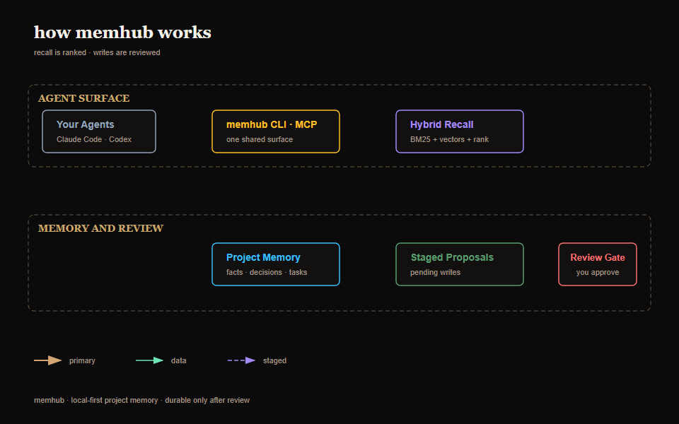
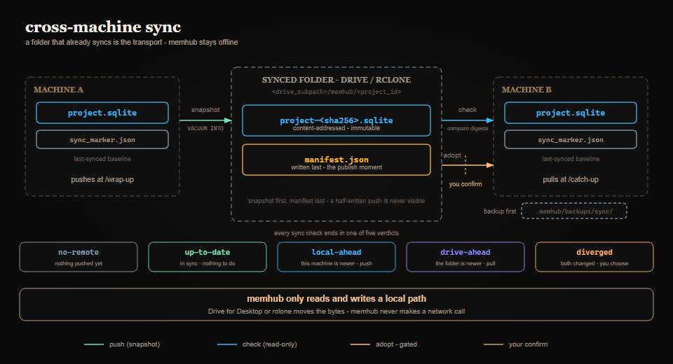
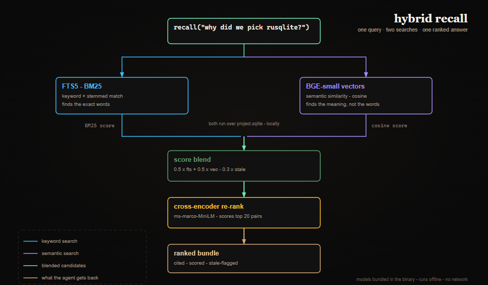

# memhub

*Your AI agents forget things. memhub doesn't.*

<p align="center">
  
  
  
  <br/>
  
  
  
  <br/>
  
</p>

---

Every new session, your AI agent starts from zero — you re-explain the build command, the naming conventions, why you chose Postgres over SQLite six months ago. memhub gives the agent a persistent, searchable memory of your project, so it looks those things up instead of asking you again.

It's one offline binary and one SQLite file next to your code, shared by Claude Code, Codex, and OpenCode: decisions (with the *why* behind them), facts, tasks, your own reference docs, and an index of where things live in your codebase. When the agent needs context, it pulls a small ranked bundle of just the relevant rows — not your whole README — so prompts stay short and your token bill stays down. No cloud, no account, no daemon; everything, including semantic search, runs locally.

**[Jump to Quickstart →](#quickstart)** · **[See how it works →](#how-it-works)**

---

## Quickstart

Each agent below gets a copy-paste prompt that installs memhub end-to-end — expand the one you use. Prefer to run the steps yourself? See **Install by hand**.

<details>
<summary><b>Install via Claude Code</b> — recommended</summary>

Open Claude Code in the repo you want memhub to track and paste:

```
Please install memhub for me, then turn on hybrid recall.

1. Clone https://github.com/kninetimmy/memhub.git into ~/src/memhub if it
   isn't already there (`git pull` if it is). Stop if the Rust toolchain
   (1.85+) is missing.
2. Run `cargo install --path ~/src/memhub --force` so `memhub` ends up on
   PATH (~/.cargo/bin must be on PATH; warn me if it isn't). First build
   takes a couple of minutes — it downloads and bundles a ~130 MB
   embedding model into the binary.
3. Run `memhub --version` to verify.
4. Register memhub as an MCP server so Claude Code can call it as a
   structured tool (this is also how its routing instructions load):
   run `claude mcp add memhub -- memhub serve` (add `--scope user` to
   make it available across your sessions).
5. Copy the user-level skills so /wrap-up, /catch-up, /check-init,
   /init-project, /recall, /locate, /reindex, /eval-recall, /doc,
   /global, /audit-md, and /upgrade all work as slash commands:

       POSIX shell (bash/zsh):
       mkdir -p ~/.claude/commands
       for f in ~/src/memhub/templates/skills/claude/*.md; do case "$(basename "$f")" in metrics.md|viz.md) continue;; esac; cp "$f" ~/.claude/commands/; done

       Windows PowerShell:
       New-Item -ItemType Directory -Force -Path "$HOME\.claude\commands" | Out-Null
       Get-ChildItem "$HOME\src\memhub\templates\skills\claude\*.md" | Where-Object { $_.Name -notin 'metrics.md','viz.md' } | ForEach-Object { Copy-Item $_.FullName "$HOME\.claude\commands\" }

6. cd back to this repo and run `memhub init`, then `memhub status`.
   Tell me what status reports.
7. Run `memhub code index` to build the local code index, then tell me
   `memhub locate "<query>"` and the `/locate` skill can now answer
   "where is X" questions with ranked file:line breadcrumbs. Report how
   many files were indexed.
8. Ask me: hybrid recall (recommended — semantic + keyword) or FTS-only
   (lighter, keyword search only)?
     - If I say hybrid: set `mode = "hybrid"` under the existing
       `[retrieval]` table in .memhub/config.toml (memhub init already
       wrote that table), then run `memhub index rebuild --actor
       claude-code:reindex`. Report how many rows were embedded. Note
       that hybrid mode already runs a bundled cross-encoder re-ranker
       over the blended FTS+vector results by default — nothing extra
       to turn on.
     - If I say FTS: nothing to do; the default is already FTS.
9. Run `memhub recall "<some keyword from my project>" --max-results 3`
   so I can see the recall surface working end-to-end.
10. Tell me about the optional machine-global store: a second SQLite at
   ~/.memhub/global.sqlite, shared by every repo on this machine, for
   machine/toolchain facts and standing engineering policy — it's the
   global-vs-repo CLAUDE.md idea, made retrievable. Off by default and
   per-repo opt-in. Ask whether to enable it for this repo:
     - If I say yes: run `memhub global enable` and report the store
       path. Note that writing to global is always a deliberate human
       action — never promote to global on your own; repo is the safe
       default.
     - If I say no: just note `/global` and `memhub global enable` are
       available anytime.
11. Tell me memhub can also ingest long reference docs (design specs,
   API contracts) as RAG-searchable material. After the first doc add,
   relevant doc chunks automatically surface in plain recall — gated by
   a relevance threshold so off-topic docs stay silent. Ask whether I
   want to ingest one now — if I give you a path, run
   `memhub doc add "<path>" --json` and report the chunk count;
   if not, just note `/doc` is available anytime.
12. Tell me memhub can sync this repo's memory between my own machines
    through a folder that already syncs (Google Drive for Desktop, or an
    rclone mount on Linux) — memhub stays offline and only reads/writes a
    local path. It's off by default and opt-in per repo. Ask whether I
    work across machines:
      - If I say yes: run `memhub sync enable`, then ask me for the
        absolute path of the synced folder on this machine and set it as
        `[sync] drive_subpath` in .memhub/config.toml. Run
        `memhub sync status` and report the resolved remote dir. Note
        that `/catch-up` pulls at session start and `/wrap-up` pushes at
        the end.
      - If I say no: just note `/catch-up`, `/wrap-up`, and
        `memhub sync enable` are available anytime.

Don't touch any files in this repo other than what `memhub init` writes
(.memhub/ and the generated-output .gitignore entries), the
.memhub/config.toml edits in steps 8, 10, and 12, and — only if I opt in
at step 10 — the machine-global store at ~/.memhub/global.sqlite (outside
this repo, in my home directory; that is expected).
```

</details>

<details>
<summary><b>Install via Codex CLI</b></summary>

Open Codex in the repo you want to track and paste:

```
Please install memhub for me, then turn on hybrid recall.

1. Clone https://github.com/kninetimmy/memhub.git into ~/src/memhub if it
   isn't already there (`git pull` if it is). Stop if the Rust toolchain
   (1.85+) is missing.
2. Run `cargo install --path ~/src/memhub --force` so `memhub` ends up on
   PATH (~/.cargo/bin must be on PATH; warn me if it isn't). First build
   takes a couple of minutes — it downloads and bundles a ~130 MB
   embedding model into the binary.
3. Run `memhub --version` to verify.
4. Register memhub as an MCP server so you can call it as a structured
   tool. Append this to ~/.codex/config.toml:

       [mcp_servers.memhub]
       command = "memhub"
       args = ["serve"]

   Codex has no repo-scoped MCP config, so also confirm this repo is
   trusted — accept Codex's own trust prompt the first time you run it
   here, or add a `[projects.<absolute-repo-path>]` table by hand with
   `trust_level = "trusted"`. Without a trust entry Codex runs this repo
   under its untrusted-project approval/sandbox posture and the
   MCP-first skill instructions won't reliably fire.

5. Copy the user-level skills so /wrap-up, /catch-up, /check-init,
   /init-project, /recall, /locate, /reindex, /eval-recall, /doc,
   /global, /audit-md, and /upgrade all work:

       POSIX shell (bash/zsh):
       mkdir -p ~/.codex/skills
       for d in ~/src/memhub/templates/skills/codex/*; do case "$(basename "$d")" in metrics|viz) continue;; esac; cp -R "$d" ~/.codex/skills/; done

       Windows PowerShell:
       New-Item -ItemType Directory -Force -Path "$HOME\.codex\skills" | Out-Null
       Get-ChildItem "$HOME\src\memhub\templates\skills\codex" -Directory | Where-Object { $_.Name -notin 'metrics','viz' } | ForEach-Object { Copy-Item $_.FullName "$HOME\.codex\skills\" -Recurse -Force }

6. cd back to this repo and run `memhub init`, then `memhub status`.
   Tell me what status reports.
7. Run `memhub code index` to build the local code index, then tell me
   `memhub locate "<query>"` and the `/locate` skill can now answer
   "where is X" questions with ranked file:line breadcrumbs. Report how
   many files were indexed.
8. Ask me: hybrid recall (recommended — semantic + keyword) or FTS-only
   (lighter, keyword search only)?
     - If I say hybrid: set `mode = "hybrid"` under the existing
       `[retrieval]` table in .memhub/config.toml (memhub init already
       wrote that table), then run `memhub index rebuild --actor
       codex:reindex`. Report how many rows were embedded. Note that
       hybrid mode already runs a bundled cross-encoder re-ranker over
       the blended FTS+vector results by default — nothing extra to
       turn on.
     - If I say FTS: nothing to do; the default is already FTS.
9. Run `memhub recall "<some keyword from my project>" --max-results 3`
   so I can see the recall surface working end-to-end.
10. Tell me about the optional machine-global store: a second SQLite at
    ~/.memhub/global.sqlite, shared by every repo on this machine, for
    machine/toolchain facts and standing engineering policy — it's the
    global-vs-repo AGENTS.md idea, made retrievable. Off by default and
    per-repo opt-in. Ask whether to enable it for this repo:
      - If I say yes: run `memhub global enable` and report the store
        path. Note that writing to global is always a deliberate human
        action — never promote to global on your own; repo is the safe
        default.
      - If I say no: just note `/global` and `memhub global enable` are
        available anytime.
11. Tell me memhub can also ingest long reference docs (design specs,
    API contracts) as RAG-searchable material. After the first doc add,
    relevant doc chunks automatically surface in plain recall — gated by
    a relevance threshold so off-topic docs stay silent. Ask whether I
    want to ingest one now — if I give you a path, run
    `memhub doc add "<path>" --json` and report the chunk count;
    if not, just note `/doc` is available anytime.
12. Tell me memhub can sync this repo's memory between my own machines
    through a folder that already syncs (Google Drive for Desktop, or an
    rclone mount on Linux) — memhub stays offline and only reads/writes a
    local path. The `memhub.sync_*` MCP tools are the agent-first
    surface; they default to the canonical synced folder. It's off by
    default and opt-in per repo. Ask whether I work across machines:
      - If I say yes: run `memhub sync enable`, then ask me for the
        absolute path of the synced folder on this machine and set it as
        `[sync] drive_subpath` in .memhub/config.toml. Run
        `memhub.sync_status` and report the resolved remote dir. Note
        that `/catch-up` pulls at session start and `/wrap-up` pushes at
        the end.
      - If I say no: just note `/catch-up`, `/wrap-up`, and
        `memhub sync enable` are available anytime.

Don't touch any files in this repo other than what `memhub init` writes
(.memhub/ and the generated-output .gitignore entries), the
.memhub/config.toml edits in steps 8, 10, and 12, and — only if I opt in
at step 10 — the machine-global store at ~/.memhub/global.sqlite (outside
this repo, in my home directory; that is expected).
```

</details>

<details>
<summary><b>Install via OpenCode CLI</b></summary>

Open OpenCode in the repo you want to track and paste:

```
Please install memhub for me, then turn on hybrid recall.

1. Clone https://github.com/kninetimmy/memhub.git into ~/src/memhub if it
   isn't already there (`git pull` if it is). Stop if the Rust toolchain
   (1.85+) is missing.
2. Run `cargo install --path ~/src/memhub --force` so `memhub` ends up on
   PATH (~/.cargo/bin must be on PATH; warn me if it isn't). First build
   takes a couple of minutes — it downloads and bundles a ~130 MB
   embedding model into the binary.
3. Run `memhub --version` to verify.
4. Register memhub as an MCP server so you can call it as a structured
   tool. Add this to ~/.config/opencode/opencode.jsonc (or
   opencode.json — OpenCode reads either extension; use whichever
   already exists on this machine):

       {
         "$schema": "https://opencode.ai/config.json",
         "mcp": {
           "memhub": {
             "type": "local",
             "command": ["memhub", "serve"],
             "enabled": true
           }
         }
       }

   If that file already exists, merge only the `mcp.memhub` block.
5. Copy the user-level skills so /wrap-up, /catch-up, /check-init,
   /init-project, /recall, /locate, /reindex, /eval-recall, /doc,
   /global, /audit-md, and /upgrade all work:

       POSIX shell (bash/zsh):
       mkdir -p ~/.config/opencode/skills ~/.config/opencode/commands
       for d in ~/src/memhub/templates/skills/opencode/*; do case "$(basename "$d")" in metrics|viz) continue;; esac; cp -R "$d" ~/.config/opencode/skills/; done
       for f in ~/src/memhub/templates/commands/opencode/*.md; do case "$(basename "$f")" in metrics.md|viz.md) continue;; esac; cp "$f" ~/.config/opencode/commands/; done

       Windows PowerShell:
       New-Item -ItemType Directory -Force -Path "$HOME\.config\opencode\skills","$HOME\.config\opencode\commands" | Out-Null
       Get-ChildItem "$HOME\src\memhub\templates\skills\opencode" -Directory | Where-Object { $_.Name -notin 'metrics','viz' } | ForEach-Object { Copy-Item $_.FullName "$HOME\.config\opencode\skills\" -Recurse -Force }
       Get-ChildItem "$HOME\src\memhub\templates\commands\opencode\*.md" | Where-Object { $_.Name -notin 'metrics.md','viz.md' } | ForEach-Object { Copy-Item $_.FullName "$HOME\.config\opencode\commands\" }

6. Restart OpenCode so it reloads config, skills, and commands.
7. cd back to this repo and run `memhub init`, then `memhub status`.
   Tell me what status reports.
8. Run `memhub code index` to build the local code index, then tell me
   `memhub locate "<query>"` and the `/locate` skill can now answer
   "where is X" questions with ranked file:line breadcrumbs. Report how
   many files were indexed.
9. Ask me: hybrid recall (recommended — semantic + keyword) or FTS-only
   (lighter, keyword search only)?
     - If I say hybrid: set `mode = "hybrid"` under the existing
       `[retrieval]` table in .memhub/config.toml (memhub init already
       wrote that table), then run `memhub index rebuild --actor
       opencode:reindex`. Report how many rows were embedded. Note that
       hybrid mode already runs a bundled cross-encoder re-ranker over
       the blended FTS+vector results by default — nothing extra to
       turn on.
     - If I say FTS: nothing to do; the default is already FTS.
10. Run `memhub recall "<some keyword from my project>" --max-results 3`
    so I can see the recall surface working end-to-end.
11. Tell me about the optional machine-global store: a second SQLite at
    ~/.memhub/global.sqlite, shared by every repo on this machine, for
    machine/toolchain facts and standing engineering policy — it's the
    global-vs-repo AGENTS.md idea, made retrievable. Off by default and
    per-repo opt-in. Ask whether to enable it for this repo:
      - If I say yes: run `memhub global enable` and report the store
        path. Note that writing to global is always a deliberate human
        action — never promote to global on your own; repo is the safe
        default.
      - If I say no: just note `/global` and `memhub global enable` are
        available anytime.
12. Tell me memhub can also ingest long reference docs (design specs,
    API contracts) as RAG-searchable material. After the first doc add,
    relevant doc chunks automatically surface in plain recall — gated by
    a relevance threshold so off-topic docs stay silent. Ask whether I
    want to ingest one now — if I give you a path, run
    `memhub doc add "<path>" --json` and report the chunk count;
    if not, just note `/doc` is available anytime.
13. Tell me memhub can sync this repo's memory between my own machines
    through a folder that already syncs (Google Drive for Desktop, or an
    rclone mount on Linux) — memhub stays offline and only reads/writes a
    local path. The `memhub.sync_*` MCP tools are the agent-first
    surface; they default to the canonical synced folder. It's off by
    default and opt-in per repo. Ask whether I work across machines:
      - If I say yes: run `memhub sync enable`, then ask me for the
        absolute path of the synced folder on this machine and set it as
        `[sync] drive_subpath` in .memhub/config.toml. Run
        `memhub.sync_status` and report the resolved remote dir. Note
        that `/catch-up` pulls at session start and `/wrap-up` pushes at
        the end.
      - If I say no: just note `/catch-up`, `/wrap-up`, and
        `memhub sync enable` are available anytime.

Don't touch any files in this repo other than what `memhub init` writes
(.memhub/ and the generated-output .gitignore entries), the
.memhub/config.toml edits in steps 9, 11, and 13, and — only if I opt in
at step 11 — the machine-global store at ~/.memhub/global.sqlite (outside
this repo, in my home directory; that is expected).
```

</details>

<details>
<summary><b>Install by hand</b></summary>

```bash
# 1. Build + install the binary (slow on first build; bundles BGE-small)
git clone https://github.com/kninetimmy/memhub.git ~/src/memhub
cargo install --path ~/src/memhub --force

# 2. Verify
memhub --version

# 3. Initialize in your project
cd /path/to/your/project
memhub init
memhub status

# 4. Warm up the code locator — builds a local index so `memhub locate`
#    (and the /locate skill) can answer "where is X" with ranked
#    file:line breadcrumbs instead of grepping around.
memhub code index
memhub code status   # confirm files indexed

# 5. Agent skills / command wrappers (Claude + Codex + OpenCode)
mkdir -p ~/.claude/commands ~/.codex/skills
for f in ~/src/memhub/templates/skills/claude/*.md; do case "$(basename "$f")" in metrics.md|viz.md) continue;; esac; cp "$f" ~/.claude/commands/; done
for d in ~/src/memhub/templates/skills/codex/*; do case "$(basename "$d")" in metrics|viz) continue;; esac; cp -R "$d" ~/.codex/skills/; done
mkdir -p ~/.config/opencode/skills ~/.config/opencode/commands
for d in ~/src/memhub/templates/skills/opencode/*; do case "$(basename "$d")" in metrics|viz) continue;; esac; cp -R "$d" ~/.config/opencode/skills/; done
for f in ~/src/memhub/templates/commands/opencode/*.md; do case "$(basename "$f")" in metrics.md|viz.md) continue;; esac; cp "$f" ~/.config/opencode/commands/; done
```

Windows PowerShell equivalent for step 5 (the `for`/`case`/`basename` loops above are POSIX-only):

```powershell
# 5. Agent skills / command wrappers (Claude + Codex + OpenCode)
New-Item -ItemType Directory -Force -Path "$HOME\.claude\commands","$HOME\.codex\skills" | Out-Null
Get-ChildItem "$HOME\src\memhub\templates\skills\claude\*.md" | Where-Object { $_.Name -notin 'metrics.md','viz.md' } | ForEach-Object { Copy-Item $_.FullName "$HOME\.claude\commands\" }
Get-ChildItem "$HOME\src\memhub\templates\skills\codex" -Directory | Where-Object { $_.Name -notin 'metrics','viz' } | ForEach-Object { Copy-Item $_.FullName "$HOME\.codex\skills\" -Recurse -Force }
New-Item -ItemType Directory -Force -Path "$HOME\.config\opencode\skills","$HOME\.config\opencode\commands" | Out-Null
Get-ChildItem "$HOME\src\memhub\templates\skills\opencode" -Directory | Where-Object { $_.Name -notin 'metrics','viz' } | ForEach-Object { Copy-Item $_.FullName "$HOME\.config\opencode\skills\" -Recurse -Force }
Get-ChildItem "$HOME\src\memhub\templates\commands\opencode\*.md" | Where-Object { $_.Name -notin 'metrics.md','viz.md' } | ForEach-Object { Copy-Item $_.FullName "$HOME\.config\opencode\commands\" }
```

```bash
# 6. MCP for Codex — append to ~/.codex/config.toml (Codex has no repo
#    scope, so this is a per-machine step, and it also needs this repo
#    trusted or the MCP-first skill instructions won't reliably fire —
#    accept Codex's trust prompt on first run here, or add
#    [projects.<abs-repo-path>] with trust_level = "trusted" by hand):
#   [mcp_servers.memhub]
#   command = "memhub"
#   args = ["serve"]

# MCP for OpenCode — merge into ~/.config/opencode/opencode.json:
#   { "mcp": { "memhub": { "type": "local", "command": ["memhub", "serve"], "enabled": true } } }

# 7. (Recommended) Turn on hybrid recall — FTS + semantic search, with a
#    bundled cross-encoder re-ranker over the blended results on by
#    default; nothing extra to enable once hybrid mode is set.
#    In .memhub/config.toml, set mode under the existing [retrieval]
#    table (memhub init already writes it):
#       mode = "hybrid"
#    Then backfill embeddings for existing rows:
memhub index rebuild --actor cli:user
memhub index status   # confirm Missing: 0

# 8. (Optional) Machine-wide memory: a second store at
#    ~/.memhub/global.sqlite shared by every repo on this machine.
#    Off by default; opt this repo in, then write/promote with --global.
memhub global enable
memhub global status

# 9. (Optional) Ingest a reference doc — after first add, relevant chunks
#    automatically surface in plain recall (relevance-gated; off-topic
#    docs stay silent). /doc wraps this as a slash command.
memhub doc add path/to/design-spec.md --json

# 10. (Optional) Cross-machine sync via a synced folder (Google Drive for
#     Desktop, or an rclone mount on Linux). memhub stays offline and only
#     reads/writes a local path. Opt in per repo, then set [sync]
#     drive_subpath in .memhub/config.toml to the absolute synced-folder
#     path. /catch-up pulls at session start; /wrap-up pushes at the end.
memhub sync enable
#    .memhub/config.toml:
#       [sync]
#       drive_subpath = "/abs/path/to/your/synced/folder"
memhub sync status   # confirms enablement + the resolved remote dir
```

</details>

---

## How it works

Three views: the system as a whole, how memory follows you between machines, and what happens inside a single recall.

### The system

<p align="center">
  
</p>

Your agents call memhub over [MCP](https://modelcontextprotocol.io/) or the CLI. Reads come back as a small ranked bundle pulled from the SQLite database sitting next to your code. When an agent wants to *save* something durable — a fact, a decision — the write is staged in `pending_writes` and waits at the review gate until you accept it. Low-stakes writes (tasks, notes, commands) go straight in, and `memhub render` keeps a human-readable `PROJECT.md` view of the whole thing.

### Sync between your machines

<p align="center">
  
</p>

Opt a repo in, and your laptop and desktop share memory through a folder that's already syncing (Google Drive for Desktop, or an rclone mount). A push writes one whole-database snapshot, manifest last — so a half-finished push is never visible to the other side. A pull compares content digests and reports one of five verdicts; adopting remote state is the one destructive step, so it always waits for your confirm and writes a backup first. memhub itself never makes a network call. [Setup →](#sync-across-your-machines-google-drive)

### Inside a recall

<p align="center">
  
</p>

A recall runs two searches at once: FTS5 finds the exact words, BGE-small embeddings find the meaning (so "compile settings" still finds the fact filed under `release_build`). The scores blend, a cross-encoder re-ranks the top candidates, and the agent gets back a small, cited, staleness-flagged bundle instead of a wall of markdown. Both models are compiled into the binary — nothing downloads at runtime, nothing leaves your machine.

---

## What you actually get

- **Context that sticks.** "What's the build command?" gets a real answer on day 90, not just day 1. You stop repeating yourself.
- **Decisions with reasons.** Six months from now you'll know *why* a call was made, not just that it was made.
- **Your docs are searchable too.** Point memhub at a spec or style guide and the agent pulls the relevant section on demand — and stays silent when the doc is off-topic.
- **It knows where your code lives.** "Where's the retry logic?" returns ranked `file:line` breadcrumbs with clipped snippets — never whole files, so it costs almost no context.
- **You stay in control.** Agent proposals stage for review; nothing becomes durable until you say yes.
- **Same memory across agents.** Claude Code, Codex, and OpenCode share the same rows. Switching tools doesn't cost you context.
- **Memory that follows you.** Opt in per repo and your machines stay in sync through a folder that's already syncing — memhub still never goes online.
- **Optional machine-wide memory.** Truths that aren't about one repo — toolchain facts, standing engineering rules — can live in an opt-in store shared by every repo on the machine.
- **It's just a file.** SQLite, gitignored, in your repo. Back it up, move it, or `rm -rf .memhub/` and it's gone.

---

## A session in practice

You talk to your agent; memhub runs in the background. At the end you run `/wrap-up`, and the agent walks you through everything it wants to commit — you say yes or no to each item.

```
You: "What did we decide about the authentication flow?"
  → memhub.recall "authentication flow"  (returns cited evidence bundle)

You: "Add a task to refactor the cache layer."
  → task_add "refactor cache layer"  (direct write)

You: "We're going to use rusqlite bundled mode because it avoids setup friction."
  → propose_decision ...  (staged for your review)

You: "/wrap-up"
  → agent walks through staged proposals one by one
  → you approve or skip each one
  → session note written, PROJECT.md re-rendered
```

The `/wrap-up` gate is the whole point: the agent is good at surfacing knowledge; you decide what's true.

You can also drive it from the terminal — both flows write to the same database:

```bash
memhub recall "auth flow"
memhub task add "Refactor cache layer"
memhub fact add build-command "cargo build --release"
memhub decision add "use rusqlite bundled mode" \
  --rationale "Avoid system SQLite setup friction."
memhub render
```

---

## Project status

<details>
<summary><b>Expand for the current snapshot</b> — pulled from the memhub task DB as of <b>2026-07-27</b> (not a live feed; run <code>memhub task list</code> in this repo for the current picture)</summary>

### Recently fixed

- **MCP `list_pending_writes` honors its documented `pending` default (2026-07-27, PR #174).** It used to pass an omitted status through as *every* status, and because `LIMIT` applied afterwards, reviewed rows could crowd genuinely pending ones out of the window entirely. It now defaults to `pending`, adds an explicit `all` spelling, and always reports the filter actually applied.
- **Cross-CLI verification sweep (2026-07-18, task 124, #168).** Codex checked end to end; OpenCode verified live for the first time (MCP round-trip and all 14 skills discoverable), so its support stays advertised. The one drift found — the `opencode.json` command block — was fixed and is now guarded by a skill-parity test.
- **Branch protection on `main` is live (2026-07-18, task 121).** PRs required, with lint and Windows/macOS build+test as required checks and `enforce_admins` on.
- **K9 removal and onboarding parity (2026-07-18, PRs #161, #162, #165).** The K9 integration subsystem is removed entirely; onboarding surfaces now offer all five current runtime toggles.
- **Run C (2026-07-17–18, PRs #151–#156): audit remediation and CI baseline.** Maintenance-on-open codified with tests, initial CI (Windows/macOS/viz lanes + weekly `cargo audit`), the `sync_md` channel retired, four small hardenings closed, docs reconciled, and rustfmt+clippy adopted with a CI lint gate.
- **Run B (2026-07-17, PRs #138–#142): sync divergence blind spots closed.** The logical-version digest now covers doc ingests and fact edits; adopt is fail-closed with online-backup restore; publication is atomic (content-addressed snapshot, manifest-last); `sync check --diff` shows per-table divergence.
- **Run A (2026-07-15, PRs #124–#128).** Transcript deletion containment, export of `facts.kind`, repo-first doc default flip, dual-shell preflights, and upgrade aside-restore.

### Known issues (non-blocking)

- **Non-blocking transcript-archive residual races**, noted during review but not yet acted on (task 122).
- **The weekly `cargo audit` job is red on `main`** — RUSTSEC-2026-0204 against `crossbeam-epoch` is the lone hard failure, alongside two non-blocking warnings: unmaintained `paste` (RUSTSEC-2024-0436) and an unsoundness advisory against `anyhow` (RUSTSEC-2026-0190). Not a required check, so it doesn't gate merges (task 127).

### Roadmap (open tasks)

- Optional Haiku recall reranker with local fallback (task 98)
- Transcript content-level secret redaction (task 103)
- Metrics follow-on read attribution (task 92)

</details>

---

## What gets saved (and when)

| Type | What it's for | Who writes it | Goes straight to DB? |
|---|---|---|---|
| **facts** | Key project knowledge: build commands, MSRV, env vars, naming conventions | You or agent | Agent: no (staged). You: yes. |
| **decisions** | Design choices with rationale and context | You or agent | Agent: no (staged). You: yes. |
| **tasks** | Lightweight to-dos and in-flight work | You or agent | Yes — low-stakes |
| **session notes** | Observations and scratch thoughts during a session | Agent | Yes — scratchpad only, not recalled |
| **commands** | Verified shell commands with success/fail tracking | You or agent | Yes — observational |
| **state / arch** | The "currently building" and architecture narratives | Agent at wrap-up | Yes — agent-authored but explicit |
| **reference docs** | External markdown you point it at: specs, contracts, style guides | You (you hand it a file) | Yes — auto-joins default recall after first ingest |

The rule behind the table: things that could be *wrong* — facts that might be outdated, decisions that might be misattributed — need a human in the loop. Ephemeral or observational things write directly.

When an agent proposal gets staged, the source is recorded as e.g. `agent:claude-code`. When you accept it at `/wrap-up`, that upgrades to `user+agent:claude-code` — both signals preserved, so you can always tell what was verified.

---

## Point it at your design docs

Sometimes what the agent needs is sitting in an existing file — a design spec, an API contract, a style guide. Don't paste it into prompts or hand-transcribe it into facts:

```bash
memhub doc add ~/specs/design-system.md
```

memhub splits the file into section-aware chunks (heading breadcrumbs preserved, so a hit knows it came from *Typography > Design Tokens*), embeds them, and makes the whole thing searchable through the same recall path as everything else.

**After the first `doc add` in a repo, relevant chunks surface in plain recall automatically.** A relevance threshold keeps it from being noisy: a UI style guide stays silent on a backend query, but a question about color tokens pulls the right spec section. When chunks don't clear the bar, recall reports an `available_docs` count — your cue to run a targeted query:

```bash
memhub recall "color token naming" --source-type doc
```

Worth knowing:

- Docs are excluded from `memhub export` — they're file-backed and re-ingestable. Re-run `doc add` on another machine.
- Re-ingesting an unchanged file is a no-op; changed content replaces every chunk in place.
- `memhub doc ls / show / rm` to manage what's ingested.
- Set `include_docs_in_default = false` in config for strict opt-in.

---

## Find where code lives

Memory answers "what did we decide?" Sometimes the question is "*where is the code that does X?*" memhub builds a local **code index** for that: it walks your repo, splits each source file into symbol-aware chunks via tree-sitter, embeds them, and lets you search by intent:

```bash
memhub code index                 # build / refresh the index
memhub locate "where does the retry backoff happen"
```

You get ranked breadcrumbs — path, line range, symbol, and a **clipped** snippet, not a wall of code:

```
1. src/net/client.rs:88-121   fn send_with_retry      (score 0.91)
     async fn send_with_retry(&self, req: Request) -> Result<Response> {
         let mut backoff = Duration::from_millis(50);…
2. src/config/retry.rs:12-19   struct RetryPolicy      (score 0.74)
```

It's a **locator, not a reader** — you (or the agent) open those exact lines with your own tools. What keeps it honest and cheap:

- **Symbol-aware** in Rust, Go, Python, TypeScript/JavaScript, Java, and C#; non-source files (docs, lockfiles, config) are excluded so prose can't out-rank code.
- **Separate from your memory** — a sibling database (`.memhub/code_index.sqlite`) with its own query path; it never pollutes recall.
- **A throwaway cache** — gitignored, never exported or synced; `memhub code rm` and rebuild anytime.
- **Automatically fresh** — every `locate` does a lazy staleness check; edited files re-chunk transparently.

Surfaces: `memhub code index|status|rm` and `memhub locate` (CLI) · `memhub.locate` (MCP) · `/locate` (skill).

---

## One machine, many projects

memhub is per-repo. Every project gets its own `.memhub/project.sqlite` — isolated, no leakage between projects. (The one deliberate exception is the opt-in machine-global store below, and even that never merges repo databases.)

```
~/code/
├── my-web-app/
│   └── .memhub/project.sqlite   ← web app memory
├── my-cli-tool/
│   └── .memhub/project.sqlite   ← CLI tool memory
└── my-library/
    └── .memhub/project.sqlite   ← library memory
```

The binary installs once at `~/.cargo/bin/memhub`. To add a project: `cd` in, `memhub init`. To uninstall a project: `rm -rf .memhub/`.

---

## Shared memory across repos (optional)

Some knowledge isn't about *this* repo — it's about this machine, or how you work everywhere: toolchain versions, install commands, a standing rule like "always integration-test against a real database." That's the machine-global store: a second SQLite at `~/.memhub/global.sqlite`, shared by every repo on this machine. The global-vs-repo `CLAUDE.md` idea — made retrievable instead of always-loaded.

**Off by default, per-repo opt-in.** When disabled, recall is byte-for-byte identical to a build without the feature.

```bash
memhub global enable     # opt this repo in; create the store if absent
memhub global status     # path, schema version, counts
memhub global disable    # opt back out (non-destructive)
```

**What belongs in it** — only the broadly-applicable kind of facts, decisions, and docs: machine/toolchain truths, standing engineering policy, a universal style guide. Never: tasks, narratives, or anything naming a repo-specific path.

**Writing to it is always a deliberate human action** — born-global from the CLI, or promoted from an existing repo row (**copy, not move**; the repo row stays and still wins locally):

```bash
memhub fact add ci-runner "self-hosted, 16 vCPU" --global
memhub decision add "Integration-test against a real DB" \
  --rationale "A mocked DB once hid a prod migration failure." --global
memhub doc add ~/refs/python-style-guide.md --global
memhub fact promote 12 --global
memhub decision promote 8 --global
```

**An agent can never write global on its own.** Its only route is a staged proposal (`propose_fact` / `propose_decision` with `global=true`) that becomes durable only when you run `memhub review accept`. One bad global write would poison every repo on the machine, so this path is deliberately never agent-automatic.

**Recall merges, then you arbitrate.** Global hits blend with repo hits in one re-ranked pool; every hit carries a `scope` of `"repo"` or `"global"`, and the agent applies **repo-overrides-global** — exactly how a repo `CLAUDE.md` overrides the global one. The store inherits the active repo's `[retrieval]` config, is per-machine, and is not part of `memhub export`. `/global` wraps all of this.

---

## Moving between machines

memhub state is machine-local by default — only code and migrations travel with the repo. To carry memory over once:

```bash
# on your current machine
memhub export ~/memhub-myproject-backup.json

# move the file (Drive, USB, scp)

# on the new machine, after cloning the repo + installing memhub
memhub init --from-backup ~/memhub-myproject-backup.json
memhub index rebuild   # re-generate embeddings from the imported rows
```

The export is versioned JSON covering facts, decisions, tasks, commands, pending writes, writes log, session notes, and both narratives. Embeddings, ingested docs, and the machine-global store are excluded — re-derive or re-add them on the target machine.

---

## Sync across your machines (Google Drive)

The export/import dance above works, but it's manual. Sync automates it: your repo's memory follows you between *your own* machines (one person, not a team) through a folder that's already syncing. The model is animated [above](#sync-between-your-machines); the guardrails worth knowing:

- **`diverged` is the one lossy case.** If both machines changed since the last sync, adopting the remote copy discards this machine's local-only changes — memhub shows both logical versions and requires an explicit yes; it never adopts automatically.
- **Adopt is guarded.** It writes a backup under `.memhub/backups/sync/` first, and refuses outright on a project-id mismatch, a snapshot from a newer memhub schema (run `memhub upgrade` first), or a checksum that disagrees with the manifest.

### Prerequisites

1. **A synced folder on every machine.** Install Google Drive for Desktop (macOS/Windows) or set up an rclone mount (Linux), and note the local path — e.g. `G:\My Drive\memhub-sync` on Windows. A leading `~` in `drive_subpath` expands to the home directory.

   > **Linux / rclone — advanced users only.** Google doesn't ship Drive for Desktop on Linux, so you mount Drive yourself with [rclone](https://rclone.org/). It works, but it's genuinely fiddly (OAuth config, a FUSE mount, keeping it alive across reboots). If that's not your thing, skip sync on Linux and use `memhub export` / `import` by hand.

   ```bash
   rclone config                                   # one-time: add a "gdrive" remote
   mkdir -p ~/gdrive
   rclone mount gdrive: ~/gdrive --vfs-cache-mode writes --daemon
   ls ~/gdrive/My\ Drive/memhub-sync               # confirm the folder is visible
   ```

   Then set `drive_subpath = "~/gdrive/My Drive/memhub-sync"` (matching the other machines). The mount must be live whenever you sync; for an unattended box, a systemd user unit keeps it up across reboots.

2. **memhub on PATH on each machine** (Quickstart above), with the same repo cloned.
3. **A git remote on the repo** (the project id derives from it), *or* an explicit `[sync] project_id` in `.memhub/config.toml`.

### Step by step

```bash
# --- once per repo, on each machine ---
memhub sync enable                       # opt this repo in
# then set the absolute synced-folder path in .memhub/config.toml:
#   [sync]
#   drive_subpath = "/Users/you/.../My Drive/memhub-sync"
memhub sync status                       # confirms enablement + the resolved remote dir
```

memhub resolves the snapshot location as `<drive_subpath>/memhub/<project_id>` — you never hand-build that path.

```bash
# --- push (end of a session on machine A) ---
memhub sync snapshot                     # write DB snapshot + manifest into the folder
memhub sync commit                       # record the baseline

# --- pull (start of a session on machine B) ---
memhub sync check                        # prints the verdict (drive-ahead / diverged / ...)
memhub sync adopt --yes                  # replace local with the snapshot (--yes = confirm gate)
memhub render                            # refresh the local PROJECT.md view
```

**You rarely type these by hand.** `/catch-up` (session start) runs the check, summarizes what's incoming, and adopts only after you approve; `/wrap-up` (session end) pushes if sync is enabled. The everyday loop is just those two commands — give Google's app a moment to finish syncing between machines.

### Surfaces

- **CLI:** `memhub sync enable | disable | status | snapshot | check | adopt | commit`
- **MCP (agent-first):** `memhub.sync_status`, `.sync_snapshot`, `.sync_check`, `.sync_commit`, `.sync_adopt` — all default to the canonical path; `sync_adopt` without `confirm=true` returns the would-change verdict and changes nothing
- **Skills:** `/catch-up` (pull) and the push tail of `/wrap-up`

Sync state (`[sync]` config and the per-machine baseline marker) is wiring, not memory — it's not part of `memhub export`.

---

## Reference

### Commands

| Command | What it does |
|---|---|
| `memhub init` | Set up `.memhub/` in a repo |
| `memhub status` | Open tasks, stale facts, pending writes, schema version |
| `memhub recall <query>` | Hybrid ranked bundle of facts/decisions/tasks/docs |
| `memhub fact add/list/verify` | Durable key-value facts (build commands, MSRV, etc.); `verify` refreshes `verified_at` only, no confidence/source rewrite |
| `memhub decision add/list` | Decisions with rationale, FTS-indexed and embedded |
| `memhub task add/list/done` | Lightweight task tracking |
| `memhub command verify` | Record verified command outcomes; derives confidence |
| `memhub note add/list` | Session notes (low-stakes scratch; not in recall) |
| `memhub state set/show` | The "current state" narrative |
| `memhub arch set/show` | The architecture narrative |
| `memhub ingest-git` | Pull commit + file history into the DB |
| `memhub doc add/ls/rm/show` | Ingest external markdown docs; scope recall with `--source-type doc` |
| `memhub locate <query>` | Find code by intent — ranked `file:line` breadcrumbs from the sibling code index |
| `memhub code index/status/rm` | Build / inspect / drop the local code index (`.memhub/code_index.sqlite`) |
| `memhub global enable/disable/status` | Opt this repo into the optional machine-wide store (`~/.memhub/global.sqlite`) |
| `memhub review list/accept/reject` | Triage agent-proposed writes |
| `memhub render` | Emit local `PROJECT.md` and `PROJECT_LEDGER.md` from the DB |
| `memhub index status/rebuild` | Embedding coverage; backfill for `fts → hybrid` migrations |
| `memhub eval retrieval` | Run the Recall@K harness against `tests/retrieval_golden.json` |
| `memhub eval locate` | Recall@K harness for the code locator |
| `memhub stats --window 7d` | Write activity by actor, review rate, stale-fact counts |
| `memhub metrics enable/status` | Hibernated; available only in an explicit `--features metrics` build |
| `memhub viz` | Hibernated; available only in an explicit `--features viz` build |
| `memhub export/import` | Portable JSON backup; cross-machine restore |
| `memhub sync enable/status/snapshot/check/adopt/commit` | Cross-machine Drive sync (M10); push/pull a whole-DB snapshot through a synced folder |
| `memhub upgrade` | Rebuild + install the binary and bring every memhub instance on this machine to head schema; resync skill wrappers |
| `memhub gc` | Reclaim stale Cargo build artifacts (memhub-owned `target/` rlibs and test binaries) |
| `memhub serve` | Stdio MCP server for Claude Code / Codex / OpenCode |

`fact add`, `decision add`, and `doc add` take `--global`; `fact promote <id> --global` and `decision promote <id> --global` copy an existing repo row up into the machine-wide store. Run any command with `--help` for flags.

### Two retrieval modes

Both are first-class; the install prompt asks you to pick one.

| | **`fts`** (default) | **`hybrid`** (recommended) |
|---|---|---|
| Scoring | FTS5 BM25 over title + body | 0.5 × FTS + 0.5 × cosine − 0.3 × stale_penalty, then re-ranked |
| What it catches | Exact terms, stemmed variants | Exact + paraphrases (`"compile a release"` → `release_build` fact) |
| Per-write cost | 0 ms | ~50 ms eager-embed inside the source-write transaction |
| Per-recall cost | <10 ms | <100 ms (brute-force cosine + ~275 ms re-ranker at pool=20) |
| Disk footprint | None beyond source rows | ~1.5 KB per row (384-dim f32 vector) |
| Network | Never | Never. Model is bundled. |
| Best for | Small projects, scripted use | Multi-month projects where you forget exact wording |

**Switching modes is non-destructive.** `fts → hybrid` needs one `memhub index rebuild`; `hybrid → fts` just stops consulting embeddings.

The `[retrieval]` block in `.memhub/config.toml`:

```toml
[retrieval]
mode = "hybrid"                  # "fts" | "hybrid"
default_max_results = 6
accepted_only_by_default = true  # filter to source IN ('user', 'user+agent:%')
include_stale_by_default = false # hide stale facts unless asked

[retrieval.scoring]
fts_weight = 0.5
vector_weight = 0.5
stale_penalty = 0.3

[global]
enabled = false                  # opt-in via `memhub global enable`
include_docs_in_default = false  # auto-flips on first `doc add --global`
```

`[global] enabled` is managed by `memhub global enable` / `disable` — it's per-machine, so the tracked `.memhub/config.example.toml` baseline ships `false`. The machine-global store has no `[retrieval]` block of its own; it inherits the active repo's.

### Compatibility

**Claude Code**

- Reads `CLAUDE.md` at session start.
- MCP server registered repo-scoped via the committed [`.mcp.json`](.mcp.json) — nothing to set up per machine.
- User-level slash commands at `~/.claude/commands/`: `/wrap-up`, `/catch-up`, `/check-init`, `/init-project`, `/recall`, `/locate`, `/reindex`, `/eval-recall`, `/doc`, `/global`, `/audit-md`, `/upgrade`. Dormant `/metrics` and `/viz` templates are retained for feature builds but not installed by default.
- Skill writes are attributed `actor=claude:wrap-up`, `source=user+agent:claude-code`.

**Codex CLI**

- Reads `AGENTS.md` at session start (same role as `CLAUDE.md`).
- User-level skills at `~/.codex/skills/`: same set as above.
- Codex has no repo-scoped MCP config, so registration is a one-time **per-machine** step in `~/.codex/config.toml` — see [Register the MCP server](#register-the-mcp-server).
- Skill writes are attributed `actor=codex:wrap-up`, `source=user+agent:codex`.

**OpenCode CLI**

- Reads `AGENTS.md` at session start (same role as Codex).
- User-level skills at `~/.config/opencode/skills/` and command wrappers at `~/.config/opencode/commands/`: same set as above.
- MCP server registered repo-scoped via the `mcp.memhub` block in the tracked `opencode.json` — nothing to set up per machine.
- Skill writes are attributed `actor=opencode:wrap-up`, `source=user+agent:opencode`.
- Non-interactive `opencode run` needs a default model configured (`opencode config`) or an explicit `-m <provider/model>` flag.

**All three at once**

Same DB, same rows. Every write is tagged, so you always know who surfaced what:

```text
source                      Meaning
────────────────────────────────────────────────────────────────────
user                        You typed `memhub fact add` directly
agent:codex                 Codex proposed it (still in pending_writes)
agent:claude-code           Claude proposed it
agent:opencode              OpenCode proposed it
user+agent:codex            Codex surfaced via /wrap-up, you approved
user+agent:claude-code      Same, Claude-side
user+agent:opencode         Same, OpenCode-side
git                         Reserved for git ingestion
observed                    Reserved for observed signals
```

### Attribution in depth

Two columns split the work:

- `source` on `facts` and `decisions` — *origin of the claim*: `user`, `agent:<id>`, `user+agent:<id>`, `git`, `observed`.
- `actor` on `writes_log` and `pending_writes` — *who performed the write*: free-form, e.g. `cli:user`, `claude:wrap-up`.

When you accept a pending proposal via `memhub review accept`, the durable row's `source` becomes `user+agent:<actor>` automatically.

### MCP server

`memhub serve` starts a stdio MCP server. Tools:

- **Read:** `status`, `search`, `recall`, `locate`, `list_tasks`, `list_decisions`, `list_facts`, `list_pending_writes`, `get_command`
- **Write (direct):** `task_add`, `task_done`, `record_command`, `log_session_note`, `render`
- **Write (staged for review):** `propose_fact`, `propose_decision` — both take an optional `global` flag; a `global=true` proposal only becomes durable in `~/.memhub/global.sqlite` on human `memhub review accept`. (`doc_add` has no `global` parameter.)
- **Cross-machine sync (M10):** `sync_status`, `sync_snapshot`, `sync_check`, `sync_commit`, `sync_adopt` — all default to the canonical `<drive_subpath>/memhub/<project_id>` folder; `sync_adopt` without `confirm=true` returns the would-change verdict and changes nothing.

#### Register the MCP server

This repo ships repo-scoped registration for the two CLIs that support it — nothing to do:

- **Claude Code** — committed [`.mcp.json`](.mcp.json) at the repo root (`mcpServers.memhub`).
- **OpenCode** — the `mcp.memhub` block in the tracked [`opencode.json`](opencode.json).

**Codex** has no repo scope, so it's a one-time **per-machine** step — append to `~/.codex/config.toml` (not committed):

```toml
[mcp_servers.memhub]
command = "memhub"
args = ["serve"]

# Trust entry, keyed by this repo's absolute path (a TOML literal
# string avoids escaping backslashes on Windows):
[projects.'C:\absolute\path\to\this\repo']
trust_level = "trusted"
# macOS/Linux: [projects."/absolute/path/to/this/repo"]
```

The `[projects.*]` table has to be re-added on every machine (and after a repo move/rename). Without a trust entry, Codex runs the repo under its untrusted-project posture and the MCP-first skill instructions won't reliably fire — if you've already accepted Codex's trust prompt for this folder, that entry already exists.

Run `memhub doctor` (or `--json`) anytime to confirm registration status per CLI.

### Backup and restore

```bash
memhub export ./memhub-backup.json     # portable, version-tagged JSON
memhub init --from-backup <path>       # init + restore in one shot
memhub import <path>                   # restore into an existing repo
memhub import <path> --force           # overwrite live data
```

Export covers facts, decisions, tasks, commands, pending writes, writes_log, session notes, and both narrative tables. Embeddings and ingested docs are excluded; run `memhub index rebuild` after import and re-run `memhub doc add` for reference docs.

### Staleness and confidence

- **Facts** go stale after 90 days without re-verification. `memhub fact verify <id|key>` refreshes `verified_at` only; `/wrap-up` offers a per-item re-verify step for the oldest facts. CLI only — agent self-verification is exactly what the untrusted-writer guardrail forbids.
- **Commands** carry a derived confidence: `success_count / (success_count + fail_count)`.
- **Embeddings** go stale when the source body changes or the bundled model changes. Recall surfaces a warning; you decide whether to run `/reindex`.

### Deny list

`.memhub/config.toml` ships with defaults blocking `.env*`, `*.pem`, `*.key`, `secrets/**`, `.aws/credentials`, and similar. The list filters both `ingest-git` writes and `search` reads. Invalid patterns fail closed.

### Eval harness

`tests/retrieval_golden.json` ships 12 starter queries for testing `Recall@K`:

```bash
memhub eval retrieval                  # markdown summary
memhub eval retrieval --json           # structured output
memhub eval retrieval --mode fts       # A/B compare modes
```

---

## How it's built

Single Rust binary over an embedded-migration SQLite database (migrations apply automatically on open). The MCP server reuses the same command layer. The embedding model is bundled at build time via `build.rs` (downloaded from Hugging Face, SHA256-pinned); no model download at runtime.

> **Offline is a runtime guarantee, not a build-time one.** The default binary never touches the network. *Building from source* downloads ~150 MB of SHA256-pinned model assets; `cargo clean` discards the cache. Airgapped source builds are unsupported today.

```text
memhub CLI / MCP
   ├── src/commands/    fact / decision / task / command / review / eval / index / ...
   ├── src/db/          path discovery, migrations, audit log
   ├── src/config/      per-repo TOML (incl. [retrieval] and [metrics] blocks)
   ├── src/mcp/         stdio MCP server, client identity normalization
   ├── src/retrieval/   BGE-small bi-encoder + ms-marco cross-encoder, hybrid recall
   ├── src/code_index/  tree-sitter chunker + walker + `locate` over the sibling code index
   ├── src/dashboard/   hibernated read-only local web UI (`viz` feature)
   ├── src/metrics/     hibernated token accounting (`metrics` feature)
   ├── src/render/      PROJECT.md and PROJECT_LEDGER.md emit
   └── src/export/      v1 portable JSON
       │
       ├── SQLite (.memhub/project.sqlite) + bundled BGE-small + ms-marco ONNX
       └── SQLite (.memhub/code_index.sqlite)  ← sibling code index, locate-only
```

---

## Hibernated: token metrics & web dashboard

Two subsystems are fully implemented but compiled out of normal builds — the default binary has no metrics surface and no dashboard, and performs no recall logging or transcript scraping.

- **Token metrics** — per-recall bundle-size accounting and real token totals scraped from Claude Code transcripts. Reactivate with `cargo build --features metrics`.
- **Web dashboard** — a localhost-only, read-only UI over the same DB. Reactivate with `cargo build --features viz` (implies `metrics`).
- **The one network call in either build:** `metrics calibrate` sends a fixed built-in corpus (never your project's content) to Anthropic's `count_tokens` endpoint — opt-in, needs `ANTHROPIC_API_KEY`, refuses cleanly without it.

---

## Principles

- **Local-first.** No network, no daemon, no account, no runtime model download.
- **One per repo.** Project boundaries are repo boundaries.
- **Boring tech.** SQLite, Rust, FTS5, brute-force cosine. No vector DB, no extension loading, no Python.
- **Agents are untrusted writers.** Agent proposals stage in `pending_writes` until a human approves. The schema enforces it.
- **Recall is read-only.** Retrieval never writes to `writes_log` or any durable table.
- **Narrow milestones.** Ship usable slices; defer speculative work until a real workflow demands it.

---

## Further reading

- [Product PRD (verbatim)](docs/reference/memhub-prd.md)
- [Operations reference](docs/reference/operations.md) — retrieval, token accounting, doc ingestion, the code index, machine-global memory, cross-machine sync, and upgrade/GC, in operational detail
- [M8 hybrid retrieval addendum](docs/reference/memhub-prd-addendum-m8-retrieval.md)
- [M9 machine-global memory addendum](docs/reference/memhub-prd-addendum-m9-machine-global-memory.md)
- [M10 Drive sync addendum](docs/reference/memhub-prd-addendum-m10-drive-sync.md)
- [M11 code locator addendum](docs/reference/memhub-prd-addendum-m11-code-locator.md)
- [Source vocabulary addendum](docs/reference/memhub-prd-source-vocabulary-addendum.md)
- [K9 deprecation addendum](docs/reference/memhub-prd-deprecation-addendum.md)
- Superseded design docs live in `docs/archive/`
- Local project state: run `memhub render`, then read `.memhub/rendered/PROJECT.md`
